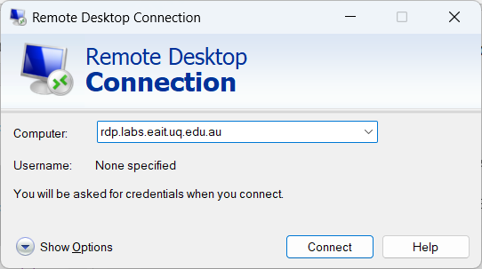
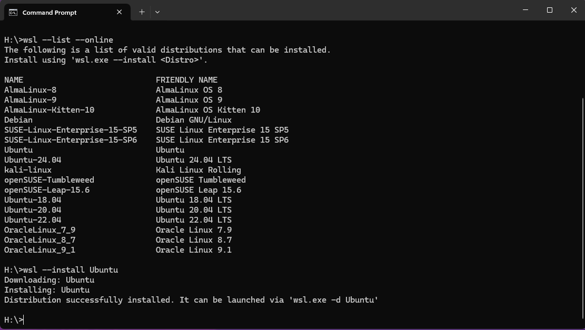
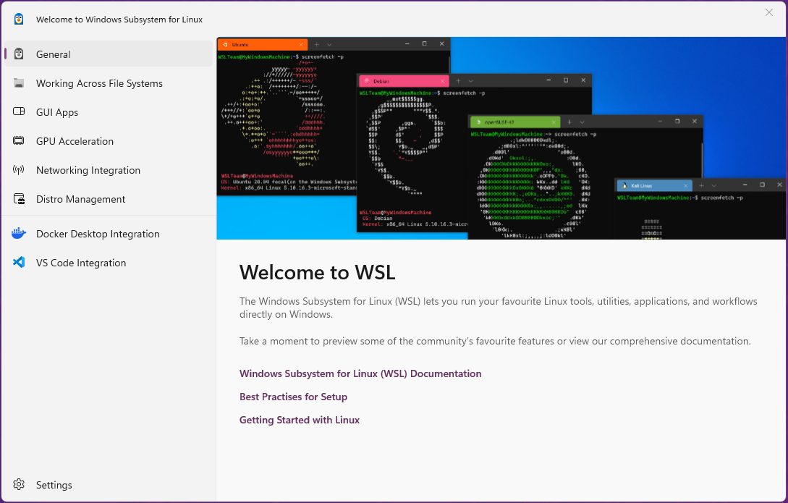

# How to Run Deep Learning on a PC Running Windows, MacOS, or Linux with Devcontainers

I have been working to make Deep Learning Accessible on Windows Machines by providing a Linux Docker Image on top of WSL Linux and connecting to the GPU.

I am currently setting up a UQ Lab Machine with an RTX2080 which is a pretty good GPU although the memory is a bit small. 

So here are the steps to getting this system up and running.

First we need to make some changes to our Windows host.  There are only three software tools we need to install.

0. Connect to a machine 78-336.
1. Windows Subsystem for Linux with a Ubuntu image.
2. Docker Desktop for Windows
3. Update Nvidia Drivers \(only required if you have a GPU\)
4. Nvidia Container Toolkit installed in the Ubuntu WSL image, not Windows. \(also only required if you have a GPU\)

Note that if you are running on Linux or a Mac, you should already have the Linux Kernel installed, so you may simply need to install docker.  If required, also install the Nvidia Container Toolkit to allow GPU access from the container.

## 1. First Connect to a PC with a GPU

Use remote desktop to connect to a machine in 78-336 by connecting to `rdp.labs.eait.uq.edu.au.`



Go through the connection diaglog and type your UQ credentials.
Finally you will see connection options including `DL_GPU_Lab (78-336).`  Select this and choose your machine from the list.  It is best to keep the same machine all the time or you may have to reinstall this software. 


## 2. So Let's Get Started on WSL

Follow these instructions based on [Microsoft Instructions](https://learn.microsoft.com/en-us/windows/wsl/install).

First check that Windows Subsystem for Linux is ticked in Windows Features as per below. Open this by searching for `Turn Windows features on or off.`


This may require a reboot before you go further. To ensure you get back to the same machine, please note the number of your machine in the pool which should be of the form `gs336-XXXX`.

A shutdown can be initiated manually by the following command:


```console
shutdown /r
```

After rebooting you can try:


```console
wsl --install
```
and it should say `wsl` is already installed. Next try to update to the latest version.

```console
wsl --update
```

Now install the Ubuntu distribution.


```console
 wsl --install Ubuntu
```


If this command fails, you may need to reboot again. 

If not, you should see the following window.


This window contains good information about how to use `wsl`. You can simply close this window for now. 

Back in the console window, type the following:


```console
 wsl -l -v
```


The * indicates the default distribution is Ubuntu and it is running WSL version 2.   

Now type


```console
 wsl
```
to open your Linux container. It will ask you for a Linux username and password, I suggest you use your UQ credentials.  The console will open in a Linux window as per below. 


You now have a Linux machine that you can access just like an app on your windows machine.  Just type `wsl` to enter Linux and `exit` to go back to Windows. Alternatively, access Ubuntu directly from the recently added applications. It is best to pin Ubuntu to the Taskbar for easy access. 

## Install pip
Install `pip` in WSL as VS Code will need it later on to add necessary extensions.


```console
sudo apt-get update && sudo apt-get install python3-pip
```
The sudo command will require your password.

If you have forgotten your <username> password, you can reset it by opening a Windows console and typing the following commands. This will open wsl as root and allows you to easily reset the password of `<username>`.


```console
wsl -u root
passwd <username>
```
Once your password is reset, reopen the WSL session and use your brand new password. 

# 3. Now we Install Docker Desktop for Windows

Simply follow the

[Docker Installation Instructions](https://docs.docker.com/desktop/install/windows-install/)

and install the software. Do not try to fetch software from the Microsoft Store as possibly suggested by Windows.  Do not attempt to install from the Microsoft store. Also note that Docker desktop runs much better on Windows 11 compared to Windows 10. 

Docker will ask you to restart your PC to complete installation.  If you are installing remotely on the UQ Labs, please wait a few minutes for the machine to reboot.  Once it appears, log in and eventually you will see the following window.


Next accept the Docker subscription agreement and Docker Desktop will open and ask you to setup or sign into your account.


Once you have done that, you are in.


Now you will need to configure Docker desktop. Go to Settings and select `Resources/WSL integration.` Make sure the sliders are set as follows to allow Docker to integrate to your Ubuntu image. Check these sliders occasionally as they sometimes get reset. 


Tip: If Docker Desktop complains about Group Permission Errors simply uninstall and download the latest version from the website.  This will fix the problem.

# 4. Update Nvidia Drivers
Some machines may have outdated Nvidia drivers.  Visit [Nvidia](https://www.nvidia.com/download/index.aspx) to download and install the latest driver for Windows.  For the 78-336 Lab you should select the GeForce/RTX20 Series and the Studio Drivers.


This will require a reboot. 

If you have a Linux machine, you should get your updated drivers and the CUDA Toolkit from [Nvidia Developer](https://developer.nvidia.com/cuda-downloads?target_os=Linux&target_arch=x86_64&Distribution=Ubuntu&target_version=22.04&target_type=deb_network).

A container is able to run on any GPU card because it mounts the local drivers. This means that the local CUDA drivers must be compatible with the container image. I currently use a very recent image of CUDA 12.2, so there is probably a need to update.


If running Ubuntu, you can use [Ubuntu Nvidia Driver Install](https://ubuntu.com/server/docs/nvidia-drivers-installation) and the following command.


```console
sudo ubuntu-drivers install
```


Just check that `nvidia-smi` works properly before moving on. 


# 5. Install Nvidia Container Toolkit in Ubuntu 22.04 WSL

Finally, if we have a GPU we need to install Nvidia Container toolkit in Ubuntu.  This allows our containers to access the GPU hardware.

First open Ubuntu from the windows command prompt by typing


```console
 wsl
```

You can check that you have opened Ubuntu-22.04 by using the lsb_release command.


```console
lsb_release -a
```


Now copy the commands to install Nvidia Container Toolkit from the [Nvidia Container Toolkit Installation Instructions](https://docs.nvidia.com/datacenter/cloud-native/container-toolkit/latest/install-guide.html).


```console
curl -fsSL https://nvidia.github.io/libnvidia-container/gpgkey | sudo gpg --dearmor -o /usr/share/keyrings/nvidia-container-toolkit-keyring.gpg \
  && curl -s -L https://nvidia.github.io/libnvidia-container/stable/deb/nvidia-container-toolkit.list | \
    sed 's#deb https://#deb [signed-by=/usr/share/keyrings/nvidia-container-toolkit-keyring.gpg] https://#g' | \
    sudo tee /etc/apt/sources.list.d/nvidia-container-toolkit.list
```

```console
sudo apt-get update 
```

```console
sudo apt-get install -y nvidia-container-toolkit
```
<!-- 
```console
sudo nvidia-ctk runtime configure --runtime=docker
``` -->
<!-- This may result in an error of the form `Config file does not exist. Creating new one`. I get this also, so simply ignore this and move forward.  -->

## Open fastai Deep Learning Software from Github in Container

Now open the windows console and clone the fastai repository to C drive, or another local disk. **Better to avoid Google Drive and H Drive** (as they are already windows mounts) or you may have container mount permission difficulties later on . This repository contains [Jeremy Howard's](https://en.wikipedia.org/wiki/Jeremy_Howard_(entrepreneur)) fantastic fastai course delivered at UQ in 2022. My latest changes are in the cpufrozen branch that I use for teaching.

You can use c: if you are careful about Windows file system issues.


```console
c:
git clone --cpufrozen https://github.com/lovellbrian/course22
```

However I really do not recommend using c: as it is Windows filesystem and will cause problems with CRLFs in the code and inabilty to use symbolic links.   I suggest you use the Linux file system.  

Open your Ubuntu-22.04 terminal by typing wsl and then clone course22 here.


```console
wsl
git clone --cpufrozen https://github.com/lovellbrian/course22
```


Now Make sure you have Visual Studio Code (or pycharm) installed in Windows or Linux.

If not, fetch Visual Studio Code from [here](https://code.visualstudio.com/download).

Open VS Code 


Switch VS Code to the linux file system by typing F1 (or Ctrl-Shift-P) then select **WSL: Connect to WSL**.  Select distribution Ubuntu-22.04.  Now you can open the **course22** folder in VS Code.

If the **WSL: Connect to WSL** option is not available, you may need to install the **WSL** extension.  You can do this by clicking on the Extensions icon on the left side of the screen and searching for **WSL**.  Install this extension and then you should be able to connect to WSL.

If WSL connection gives an error message, delete the .vscode-server folder in your linux home directory and try again.


```console
rm -rf ~/.vscode-server
```

Once opened, VS Code may ask a few questions such as asking to install the devcontainers extension. Accept the suggestions. Eventually, it will ask you for permission to `Reopen in a Container.`  This will now create a new container to run your code.  Please click on `Show Log` to see the software being installed live. 


Enjoy the scrolling text or go make yourself a coffee.  This will take 15 or more minutes on the first run.  However, the next run will be only a few seconds. 

Now open the Notebook `00-is-it-a-bird-creating-a-model-from-your-own-data.ipynb.`
Click on `Run All` at the top of the screen.  It will then ask you to choose a kernel source.  Select Python Environments and the recommended version of Python.  Now the notebook should be running. 

First, the notebook will fetch one bird image and then one forest image from the internet.  Next it will download 200 birds and 200 non-birds to build a training set which should take about 7 minutes. After some clean up steps, the notebook will run deep-learning code to train a RESNET-18 classifier network.  All learning is perfomed in vision learner. Note the graphics which shows you the learning progress. We are running 3 epochs and 6 batches per epoch. You will likely see that the error rates are very low approaching 0.  

Training will take several minutes using the CPU only which is the default (less than 1 minute on our lab machine GPUs).  Finally, the notebook will check the original bird image to see if it is a bird.  Pretty cool, huh.

Next we will run the same example using the GPU instead of the CPU. Now to perform this step you will need access to a PC with GPU installed. An easy way to check for a GPU is to run the following in either your windows or Linux console.


```console
nvidia-smi
```
This will give you an output like this on our lab machines.  This image shows that we have one NVIDIA GeForce RTX 2080 GPU Card with 8Gb of Memory in slot 0. This is a pretty fast card but the memory is a bit low for large CNNs.  I prefer 16Gb or more. 


All we need to do is to change the files in .devcontainer so they are the same as .devcontainerGPU.   There are a number of ways to do this, but a convenient way is to simply swap to the gpu branch of the repository. 

At the bottom left of the screen, you will see the word `master.`  Click on this and select the gpu branch of the repository.  The master and the cpu branch should be identical, but the content of .devcontainer is different for the gpu branch. Now select View/Command Palette and select Dev Containers: `Rebuild and Reopen in Container.`  This will load the GPU Container which will take a few minutes once again.  Time for your next coffee -  I`m grabbing one now. 


When we run with the gpu image the code is much faster as the GPU does most of the work. You can use the following command to monitor the GPU.


```console
nvtop
```
Notice how the GPU is working when the training code starts.

If you don't see these graphs, try updating your nvidia drivers as above. 


Why is the GPU only showing about 50% load? This means it does not have enough work to do.  So how do we give it more work? Perhaps we need to increase the batch size. 

Try increasing the batch size to speed up your learning (not telling how, but you need to insert bs=128 somewhere). The default batch size is 64.  Make sure you have upgraded your shm memory in Docker to avoid crashing. Try batch sizes of, say, 16, 32, 64, 128, and 256. Here is 256.  Which gives the fastest learning. Please try to explain what is going on.


## Troubleshooting
If your system is not working properly, try rebooting the WSL subsystem with:


```console
wsl --shutdown
```
A popup window will then ask you to restart `wsl`.  This often fixes it.  After restarting wsl, you can restart docker desktop. 

Enjoy!

Happy coding on your personal Linux GPU Container. 

Brian


<!-- Put Javascript here! -->

<script src="/assets/scripts/copyCode.js" async> </script>