# How to Run Deep Learning on a Windows PC with Devcontainers

I have been working to make Deep Learning Accessible on Windows Machines by providing a Linux Docker Image on top of WSL Linux and connecting to the GPU.

I am currently setting up a Lab Machine with an RTX2080 which is a pretty good GPU.

So here are the steps to getting this up and running.

First we need to make some changes to our Windows host.  There are only three software tools we need to install.

1. Windows Subsystem for Linux with a Ubuntu image.
2. Docker Desktop for Windows
3. Nvidia Container Toolkit installed in the Ubuntu WSL image, not windows. 

## So Let's Get Started on WSL

First check that Windows Subsystem for Linux is ticked in Windows Features as per below.

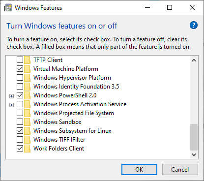

Now open a command window (cmd) in administrator mode and install wsl.  Then install the Ubuntu-22.04 distribution with the following instructions.
https://learn.microsoft.com/en-us/windows/wsl/instal
 ```console
 wsl --install
 ```
 It will ask for a Linux username and password. I suggest you use your UQ credentials. 

 Then

 ```console
 wsl --install --distribution Ubuntu-22.04
 ```

 This will take a few minutes and you see the following when done.

 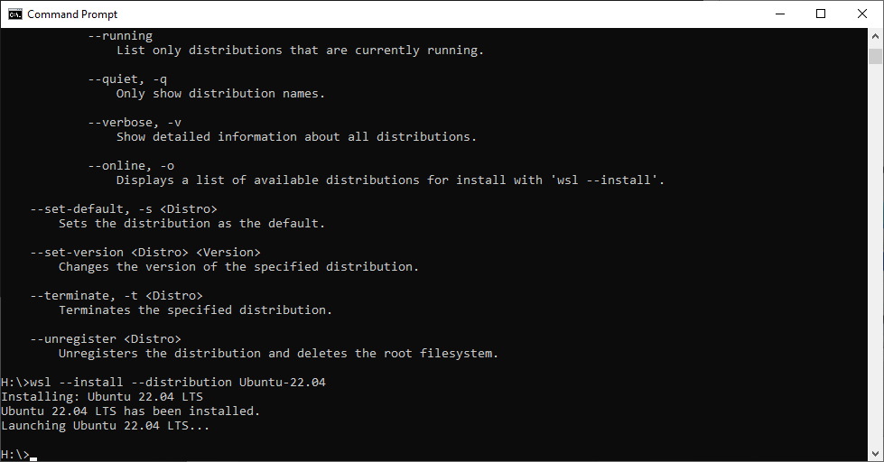

The console will open a Linux window as per below.

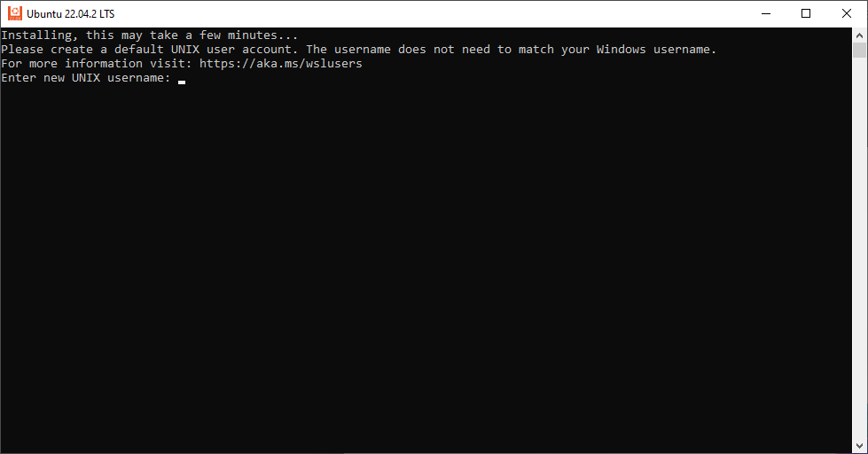

Select a Linux username and password.  I suggest you use your UQ credentials. 
 
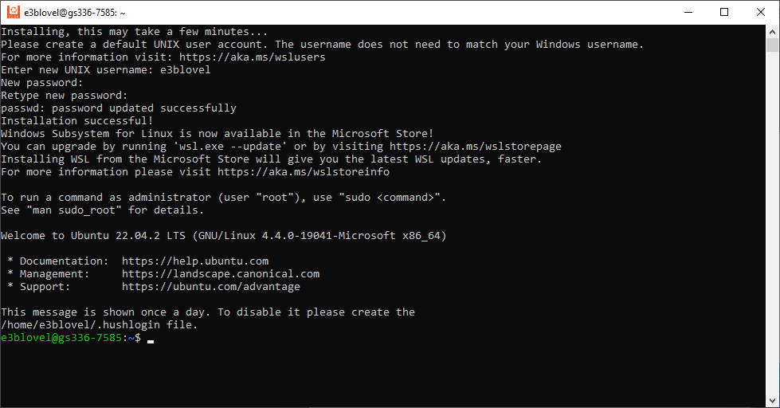

You now have a Linux machine that you can access just like an app on your windows machine.  Just type wsl to enter linux and exit to go back to windows. Alternatively, Access Ubuntu directly from the recently added applications. It is best to pin Ubuntu to the Taskbar. 

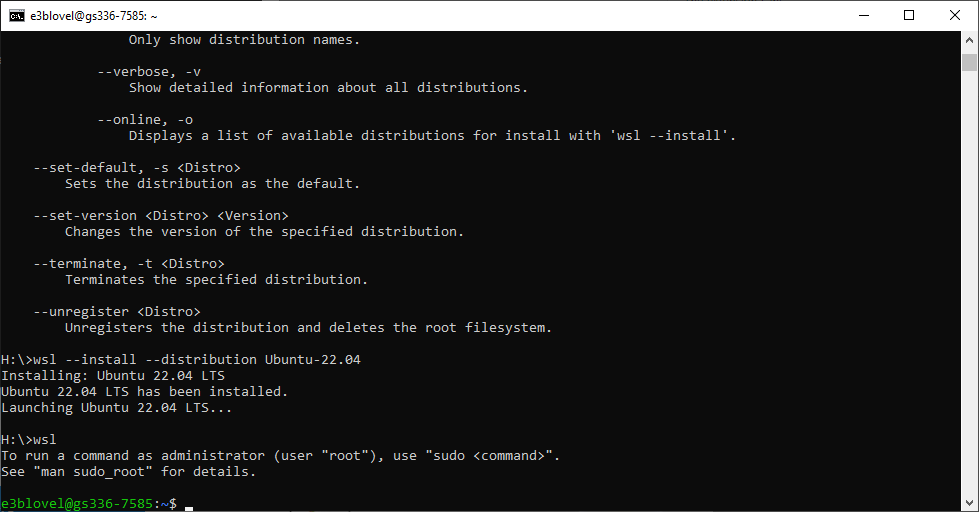

If all is well type 
```console
 wsl -l -v
 ```

 and you should see the following.  the * indicates the default distribution is Ubuntu-22.04 and it is running WSL version 2.

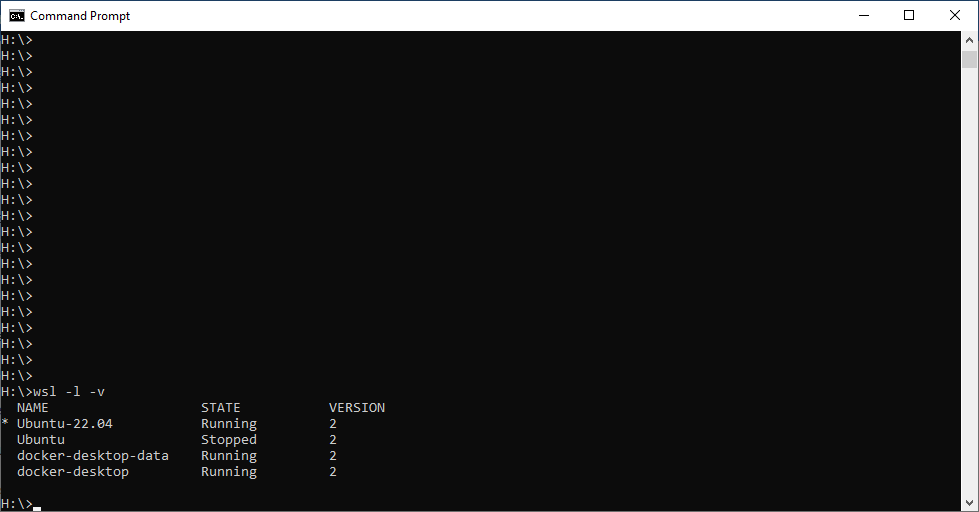

# Now we Install Docker Desktop for Windows

Simply go to

https://docs.docker.com/desktop/install/windows-install/

and install the software. Docker will then ask you to restart your PC to complete installation. 


Next accept the Docker subscription agreement and Docker Desktop will open and ask you to setup or sign into your account.

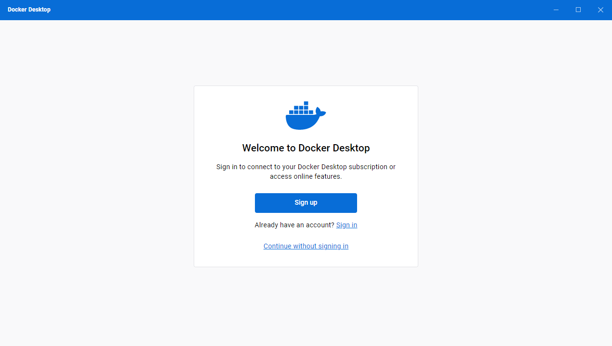

Once you have done that, you are in.

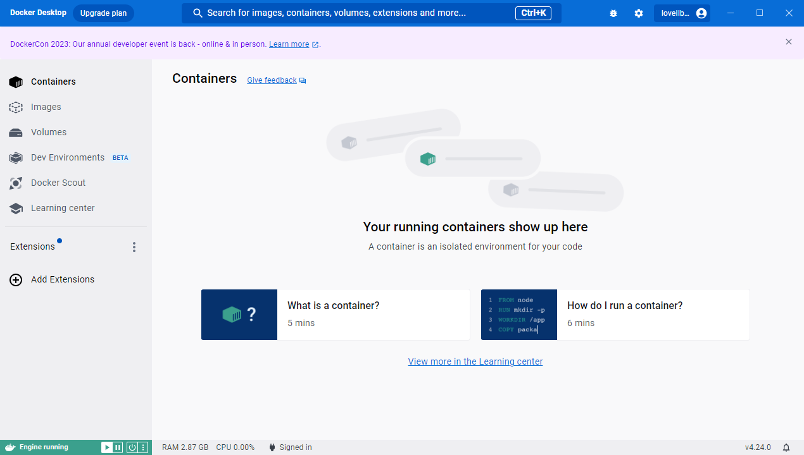

Now you will need to configure Docker desktop. Go to Settings and select Resources/WSl integration. make sure the sliders are set as follows to allow Docker to integrate to both the Ubuntu images. 

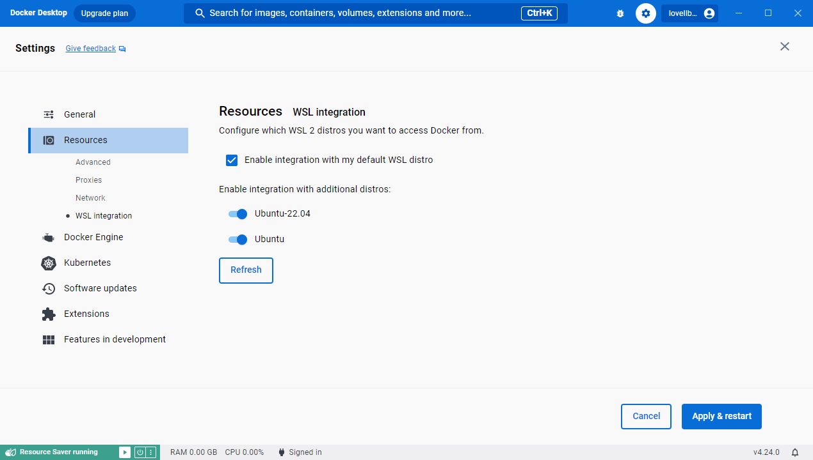

Next we need to upgrade the shared memory allocation. Select Docker engine and edit the conguration file as follows.

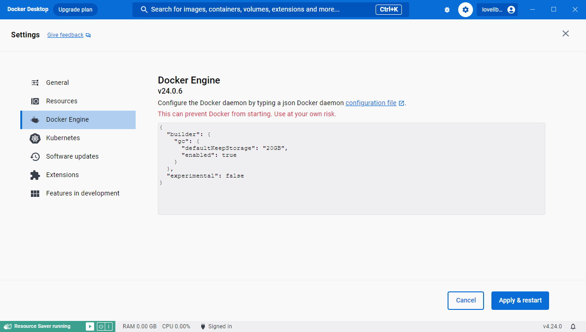

Then click Apply and Restart.


# Install Nvidia Container Toolkit in Ubuntu 22.04 WSL

Finally we need to install Nvidia Container toolkit in Ubuntu.  This allows our containers to access the GPU. 

First open Ubuntu from the windows command prompt by typing

```console
 wsl
 ```

 You can check that you have opened Ubuntu-22.04 by using the lsb_release command.

 ```console
 lsb_release -a
 ```

 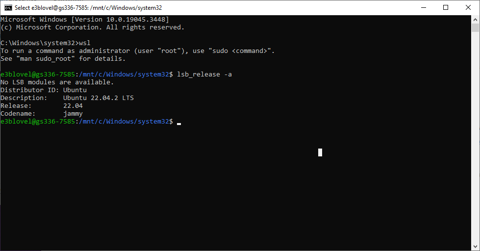

 Now copy the commands to install Nvidia Container Toolkit from 

 https://docs.nvidia.com/datacenter/cloud-native/container-toolkit/latest/install-guide.html


 
 ```console
 curl -fsSL https://nvidia.github.io/libnvidia-container/gpgkey | sudo gpg --dearmor -o /usr/share/keyrings/nvidia-container-toolkit-keyring.gpg \
  && curl -s -L https://nvidia.github.io/libnvidia-container/stable/deb/nvidia-container-toolkit.list | \
    sed 's#deb https://#deb [signed-by=/usr/share/keyrings/nvidia-container-toolkit-keyring.gpg] https://\#g\' | \
    sudo tee /etc/apt/sources.list.d/nvidia-container-toolkit.list \
  && \
    sudo apt-get update
 
 ```
 ```console
 sudo apt-get install -y nvidia-container-toolkit
 ```
 ```console
 sudo nvidia-ctk runtime configure --runtime=docker
 ```

 # Open fastai Deep Learning Software in Container

 Now get back to a windows console window and clone my repository to H: drive.  Do not use Google Drive or H Drive or you will have mount permission difficulties. 

 ```console
 c:
 git clone https://github.com/lovellbrian/course22
 ```
 Make sure you have visual studio code (or pycharm) installed. 

 If not fetch from https://code.visualstudio.com/download .

 Open Visual Studio Code 

 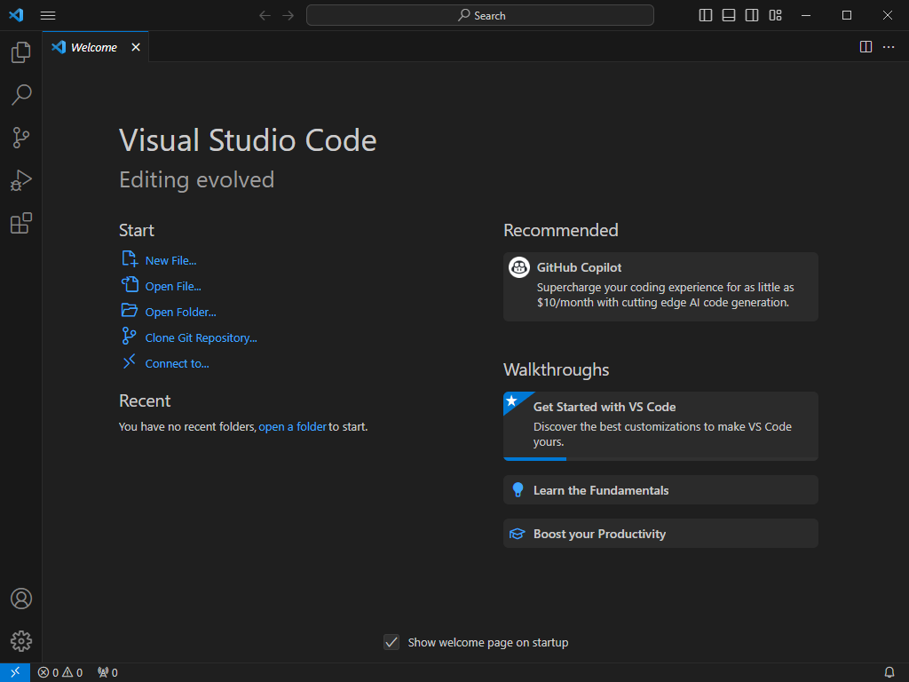

Open your cloned folder H:course22.

VS Code may ask a few questions such as asking to install the devcontainers extension. Accept the suggestions. Eventually it will ask you permission to Reopen in a Container.  This will now create a new container to run your code.  Please click on Show Log to see the software being installed. 

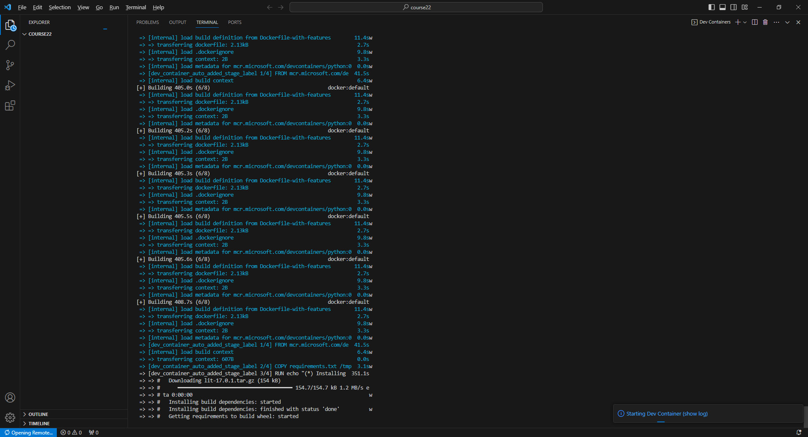

Enjoy the scrolling text or go make yourself a coffee.  This will take 15 or more minutes on the first run.  The next run will be a few seconds. 

Now open the Notebook *00-is-it-a-bird-creating-a-model-from-your-own-data.ipynb*.
Click on Run All at the top of the screen.  It will then ask you to choose a kernel source.  Select Python Enviroments and the recommended version of Python.  Now the notebook should be running. 

First it will fetch one bird image and one forest image from the internet.  Next it will download 200 birds and 200 non-birds to build a training set which should take about 7 minutes. After some clean up steps, the notebook will run deep-learning code to train a RESNET-18 classifier network.  All the learning is in vision learner. Note the graphics which shows you the learning progress. We are running 3 epochs and 6 batches per epoch. You will likely see that the error rates are very low approaching 0.  

Training will take a few minutes using the CPU only which is the default (only 1 minute on our lab machines).  Finally, the notebook will check the original bird image to see if it is a bird.  Pretty cool, huh.


Next we will run the same example using the GPU instead of the CPU. 

All we need to do is to change the files in .devcontainer so they are the same as .devcontainerGPU.   There are a number of ways to do this, but a convenient way is to simply swap to the gpu branch of the repository. 

At the bottom left of the screen, you will see the word master.  Click on this and select the gpu branch.  The master and the cpu branch should be identical. Now select View/Command Palette and select Dev Containers: Rebuid and Reopen in Container.  This will load the GPU Container which will take a few minutes once again.  Time for your next coffee -  I'm grabbing one now. 

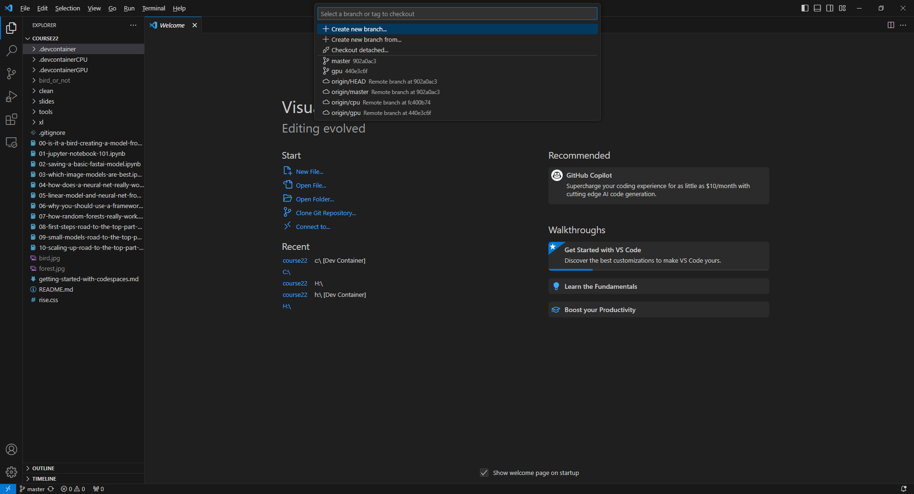