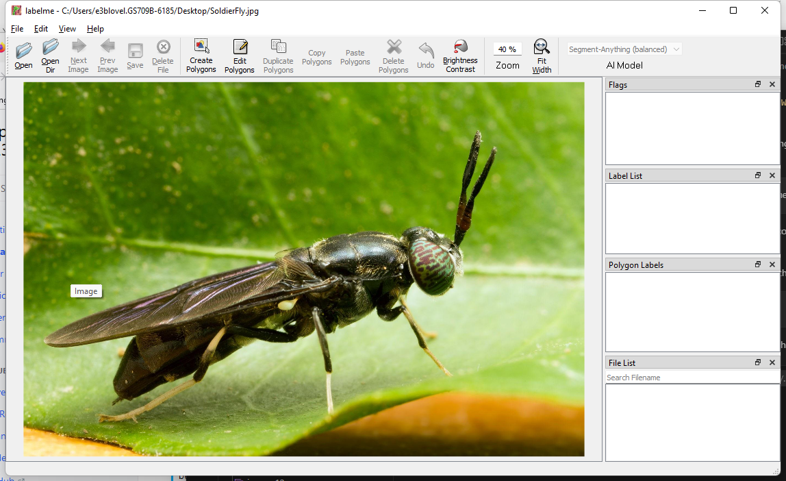
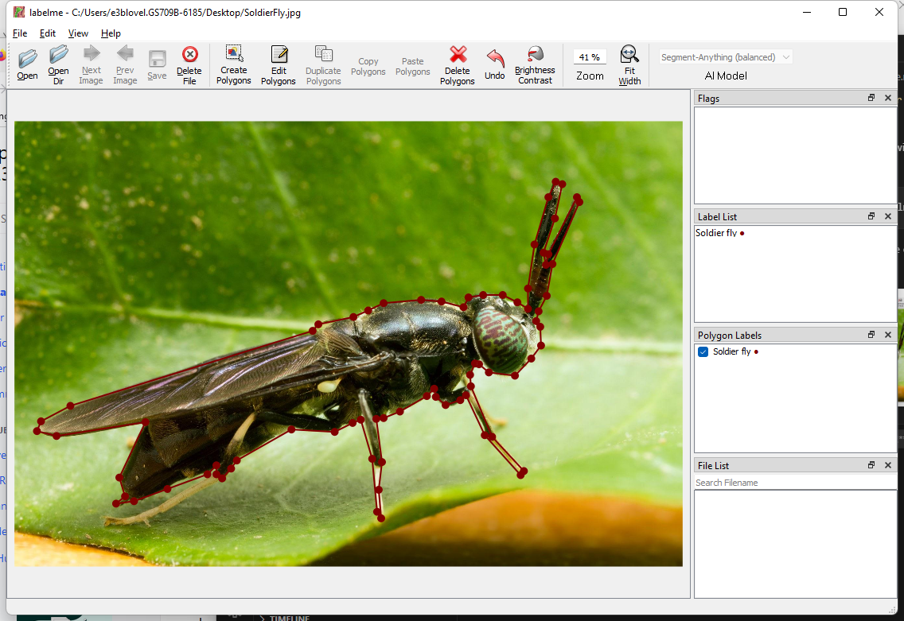

# Using LabelMe to Annotate Images

Labelme is a simple image annotation tool available as a python package for Windows or Linux.

First install `python for Windows` from [python.org](https://www.python.org/downloads/release/python-3120/).

Then just use the following command to install.


```console
pip install labelme
```

Then run `labelme` from the console


```console
labelme
```
You'll get a window like this.



Click on `Create Polygons` to start labelling.



Enjoy!

Happy Labelling,
Brian


<!-- Put Javascript here! -->

<script src="/assets/scripts/copyCode.js" async> </script>